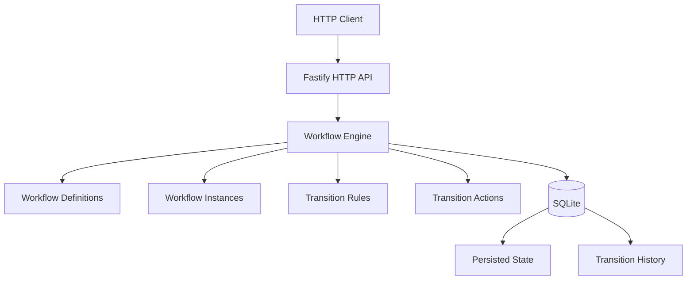
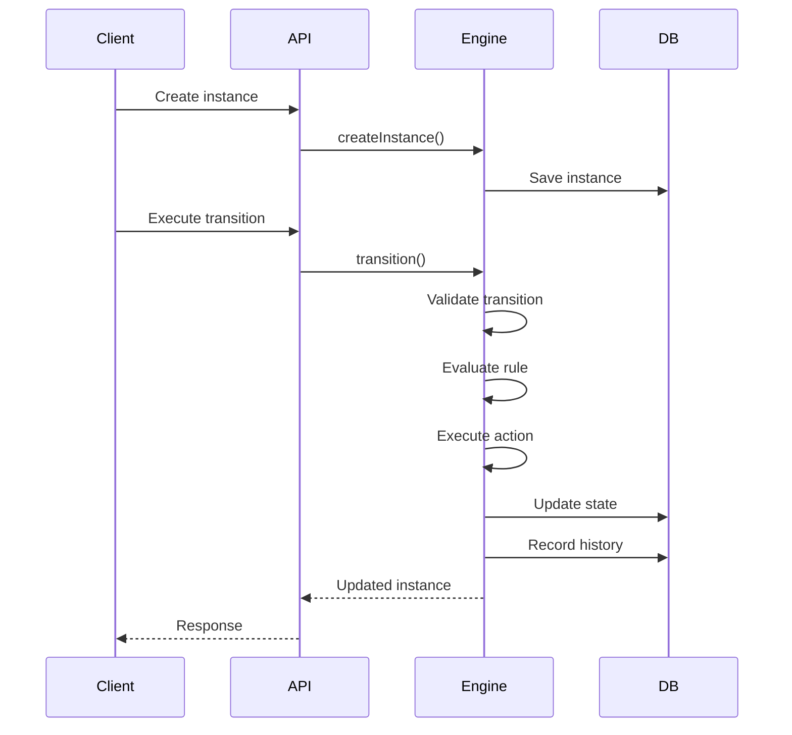
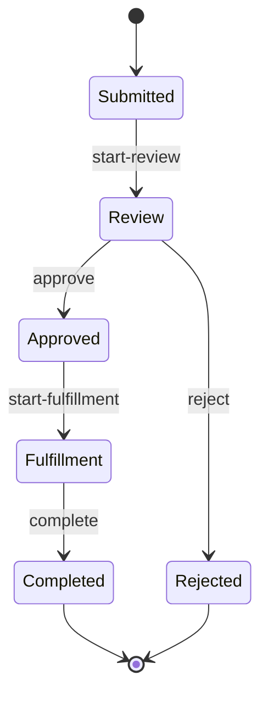

# Workflow Engine

```{=html}
<p align="center">
```
`<strong>`{=html}A lightweight, persistent workflow engine for
state-based business processes.`</strong>`{=html}
```{=html}
</p>
```
```{=html}
<p align="center">
```
`<a href="https://github.com/osmanbinabubakar/workflow-engine/actions/workflows/ci.yml">`{=html}``{=html}`</a>`{=html}
``{=html}
``{=html}
``{=html}
``{=html}
``{=html}
```{=html}
</p>
```
```{=html}
<p align="center">
```
`<a href="#overview">`{=html}Overview`</a>`{=html} ·
`<a href="#architecture">`{=html}Architecture`</a>`{=html} ·
`<a href="#workflow-example">`{=html}Example`</a>`{=html} ·
`<a href="#http-api">`{=html}API`</a>`{=html} ·
`<a href="#run-locally">`{=html}Run`</a>`{=html} ·
`<a href="#testing">`{=html}Testing`</a>`{=html}
```{=html}
</p>
```

------------------------------------------------------------------------

## Overview

Business applications frequently contain processes that move through
predictable states:

``` text
Submitted → Review → Approved → Fulfillment → Completed
```

The domain can change --- purchase requests, approvals, onboarding,
claims, fulfillment --- while the underlying mechanics remain similar.

**Workflow Engine** extracts those mechanics into a reusable TypeScript
backend component.

### What it provides

-   Configurable workflow definitions
-   Workflow instances
-   Explicit state transitions
-   Conditional transition rules
-   Transition actions
-   Persistent SQLite storage
-   Audit history
-   State recovery after application restart
-   REST-style HTTP API
-   Workflow-definition validation
-   Automated unit and API tests
-   Docker support
-   GitHub Actions CI

## Architecture



### Execution flow



## Workflow Example

The repository includes a purchase-request workflow:



The engine itself is not coupled to purchase requests.

An application can define its own workflow:

``` ts
const workflow = {
  id: "approval",
  name: "Approval Workflow",
  initialState: "submitted",
  states: [
    { id: "submitted", name: "Submitted" },
    { id: "approved", name: "Approved" }
  ],
  transitions: [
    { id: "approve", from: "submitted", to: "approved" }
  ]
};
```

## Core Concepts

### Workflow Definition

A workflow definition describes the legal states and transitions of a
process.

``` text
Workflow
├── States
├── Initial state
└── Transitions
    ├── Source state
    ├── Target state
    ├── Optional rule
    └── Optional action
```

### Workflow Instance

A workflow instance represents one execution of a workflow.

``` text
Instance
├── ID
├── Workflow ID
└── Current state
```

### Transition

A transition moves an instance from one state to another.

Before the transition is applied, the engine verifies:

1.  The instance exists.
2.  The workflow exists.
3.  The transition exists.
4.  The transition is valid for the current state.
5.  The optional business rule passes.

After a successful transition:

1.  The instance state changes.
2.  The optional action executes.
3.  The new state is persisted.
4.  An audit entry is recorded.

## Persistence & Recovery

SQLite stores:

-   Workflow definitions
-   Workflow instances
-   Current state
-   Transition history

The engine reloads persisted workflows, instances, and history when the
application starts.

``` text
Application
    ↓
Create instance
    ↓
Transition
    ↓
Persist state
    ↓
Application stops
    ↓
Application starts again
    ↓
State is restored
```

The local database file is intentionally excluded from Git.

## HTTP API

  Method   Endpoint                       Purpose
  -------- ------------------------------ -----------------------------
  `GET`    `/health`                      Health check
  `POST`   `/workflows`                   Register a workflow
  `POST`   `/instances`                   Create a workflow instance
  `POST`   `/instances/:id/transitions`   Execute a transition
  `GET`    `/instances/:id`               Retrieve an instance
  `GET`    `/instances/:id/history`       Retrieve transition history

```{=html}
<details>
```
```{=html}
<summary>
```
`<strong>`{=html}API examples`</strong>`{=html}
```{=html}
</summary>
```
### Health check

``` http
GET /health
```

``` json
{
  "status": "ok"
}
```

### Register a workflow

``` http
POST /workflows
Content-Type: application/json
```

``` json
{
  "id": "approval",
  "name": "Approval Workflow",
  "initialState": "submitted",
  "states": [
    { "id": "submitted", "name": "Submitted" },
    { "id": "approved", "name": "Approved" }
  ],
  "transitions": [
    {
      "id": "approve",
      "from": "submitted",
      "to": "approved"
    }
  ]
}
```

### Create an instance

``` http
POST /instances
Content-Type: application/json
```

``` json
{
  "workflowId": "approval",
  "instanceId": "REQ-1001"
}
```

### Execute a transition

``` http
POST /instances/REQ-1001/transitions
Content-Type: application/json
```

``` json
{
  "transitionId": "approve"
}
```

### Retrieve an instance

``` http
GET /instances/REQ-1001
```

### Retrieve history

``` http
GET /instances/REQ-1001/history
```

```{=html}
</details>
```
## Validation

Workflow definitions are validated before registration.

The API rejects malformed definitions such as:

-   Missing required properties
-   Empty state definitions
-   Invalid initial states
-   Duplicate workflow registration
-   Transitions referencing unknown states
-   Invalid transition structures

## Testing

The project uses [Vitest](https://vitest.dev/) for automated testing.

``` bash
npm test
```

The current suite contains **15 tests** covering:

-   Instance creation
-   Initial state handling
-   Valid transitions
-   Invalid transitions
-   Transition rules
-   Transition actions
-   Instance retrieval
-   Transition history
-   API workflow registration
-   API instance creation
-   API transitions
-   API history retrieval
-   Invalid API requests
-   Invalid workflow definitions
-   Workflow state validation

GitHub Actions runs the same test suite on pushes to `main` and pull
requests.

## Run Locally

```{=html}
<details>
```
```{=html}
<summary>
```
`<strong>`{=html}Local development commands`</strong>`{=html}
```{=html}
</summary>
```
### Requirements

-   Node.js 24+
-   npm

### Install

``` bash
npm install
```

### Test

``` bash
npm test
```

### Run the example

``` bash
npx tsx src/examples/purchase-request.ts
```

### Start the API

``` bash
npx tsx src/server.ts
```

The API listens on:

``` text
http://127.0.0.1:3000
```

Check it:

``` bash
curl http://127.0.0.1:3000/health
```

Expected:

``` json
{
  "status": "ok"
}
```

```{=html}
</details>
```
## Run with Docker

```{=html}
<details>
```
```{=html}
<summary>
```
`<strong>`{=html}Docker commands`</strong>`{=html}
```{=html}
</summary>
```
Build:

``` bash
docker build -t workflow-engine .
```

Run:

``` bash
docker run --rm -p 3000:3000 workflow-engine
```

Check:

``` bash
curl http://127.0.0.1:3000/health
```

The image includes the native build dependencies required by
`better-sqlite3` and compiles the TypeScript application into the image.

```{=html}
</details>
```
## CI

GitHub Actions runs on pushes to `main` and pull requests.

``` text
Push / Pull Request
        ↓
Ubuntu runner
        ↓
Node.js 24
        ↓
npm ci
        ↓
npm test
        ↓
Pass / Fail
```

[](https://github.com/osmanbinabubakar/workflow-engine/actions/workflows/ci.yml)

## Project Structure

``` text
workflow-engine/
├── .github/
│   └── workflows/
│       └── ci.yml
├── src/
│   ├── database.ts
│   ├── engine.test.ts
│   ├── index.ts
│   ├── server.test.ts
│   ├── server.ts
│   └── examples/
│       └── purchase-request.ts
├── .dockerignore
├── .gitignore
├── Dockerfile
├── package.json
├── package-lock.json
├── README.md
└── tsconfig.json
```

  File                                 Responsibility
  ------------------------------------ ----------------------------------
  `src/index.ts`                       Workflow engine and domain types
  `src/database.ts`                    SQLite persistence
  `src/server.ts`                      Fastify HTTP API
  `src/engine.test.ts`                 Core engine tests
  `src/server.test.ts`                 API tests
  `src/examples/purchase-request.ts`   Complete workflow example
  `Dockerfile`                         Container image
  `.github/workflows/ci.yml`           Automated CI

## Design Goals

The project emphasizes:

-   Explicit state transitions
-   Deterministic workflow behavior
-   Business-rule enforcement
-   Persistent application state
-   Auditability
-   Separation of domain logic and transport
-   Testability
-   Type safety
-   Reproducible execution

It deliberately avoids introducing distributed infrastructure simply for
complexity's sake.

## Current Status

### Implemented

-   [x] Workflow definitions
-   [x] Workflow instances
-   [x] State transitions
-   [x] Conditional rules
-   [x] Transition actions
-   [x] SQLite persistence
-   [x] Restart recovery
-   [x] Transition history
-   [x] HTTP API
-   [x] API validation
-   [x] Automated tests
-   [x] Docker support
-   [x] GitHub Actions CI

## Future Direction

Potential extensions, if the domain requires them:

-   Persistence abstraction
-   Additional database adapters
-   Event publishing
-   Authentication and authorization
-   Richer workflow expressions
-   Asynchronous actions
-   Versioned workflow definitions

These are intentionally outside the current implementation.

------------------------------------------------------------------------

```{=html}
<p align="center">
```
`<sub>`{=html}Built as a focused backend engineering
project.`</sub>`{=html}
```{=html}
</p>
```
